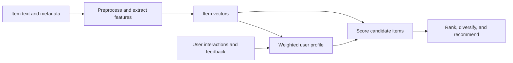

As briefly introduced in previous chapters, **content-based recommendation systems** are a class of information filtering techniques that generate recommendations by analyzing the characteristics and descriptive information associated with items. Rather than relying on the preferences of other users, these systems recommend items that are similar in content to those a particular user has previously liked or interacted with.

In this section, we examine this recommendation paradigm in detail and provide a brief overview of the major techniques used to implement content-based recommendation systems.

We begin with an intuitive example before moving to a formal definition of the approach.

Consider **Mohammad**, a graduate student in Computer Science who is passionate about science fiction movies. Over time, he has searched for and watched numerous science fiction films on an online streaming platform. As a result, the platform gradually learns his preferences. Each time Mohammad visits the platform, he is presented with a list of movies that closely match his interests. Instead of spending a significant amount of time browsing through thousands of titles, he can quickly discover newly released science fiction movies that he has not yet watched.

The recommendation engine in this example can be regarded as a **content-based recommendation system**, provided that the recommendations are generated by comparing the characteristics of the movies Mohammad has watched with the characteristics of other available movies. If, instead, the platform generates recommendations by analyzing the preferences of users with similar tastes, then it would be an example of a **collaborative filtering** system, which will be discussed extensively in later chapters.

In other words, content-based recommendation systems select candidate items by measuring the similarity between the content of previously consumed items and the content of other items available in the system. This makes the previous example an intuitive illustration of how content-based recommendation works in practice.

Having developed an intuitive understanding of the concept, we can now provide a formal definition.

A **Content-Based Filtering** system analyzes descriptive information associated with items—such as products, research articles, books, movies, music, or other content—to construct a **feature representation** (or **item representation**) for each item. It then compares these representations with a **user profile**, which summarizes the characteristics of items the user has previously liked, rated highly, purchased, or otherwise interacted with. Based on this comparison, the system recommends new items whose representations are most similar to the user's established preferences.

The primary objective of these systems is to estimate how likely a user is to appreciate a particular item. By automatically filtering large collections of information and presenting only items that closely match a user's interests, content-based recommendation systems provide a more personalized and efficient user experience. Instead of manually searching through an overwhelming number of options, users receive recommendations that are likely to align with their individual preferences.

To generate these recommendations, the system performs several processing stages on the information stored in its database. These stages form the overall content-based recommendation pipeline, illustrated conceptually in the following diagram.

**Content-Based Recommendation System Workflow**

## 1. Data Collection and Preparation

The first stage involves gathering all relevant information available in the database.

This typically includes collecting **item metadata** and other structured or unstructured information, such as:

- Product descriptions
    
- Item titles
    
- Categories and tags
    
- User reviews
    
- Technical specifications
    
- Keywords
    
- Other textual or structured metadata
    

The quality and completeness of this information directly influence the quality of the generated recommendations. Richer item descriptions generally enable more accurate modeling of item characteristics.

## 2. Feature Extraction

Once the data has been collected, the next objective is to transform raw information into meaningful numerical representations that can be processed by machine learning algorithms.

### 2.1 Data Preprocessing

Raw textual data is rarely suitable for direct processing. It often contains noise, redundant information, formatting inconsistencies, and irrelevant words.

Consequently, preprocessing is performed to clean and normalize the data before feature extraction. Most preprocessing techniques originate from **Natural Language Processing (NLP)**, many of which are discussed in detail in dedicated NLP courses. Throughout the following chapters, we will also revisit the preprocessing techniques that are particularly relevant to recommendation systems.

Typical preprocessing operations include:

- Removing stop words
    
- Tokenization
    
- Lowercasing text
    
- Removing punctuation and special characters
    
- Stemming
    
- Lemmatization
    
- Handling misspellings and abbreviations
    
- Eliminating duplicate or irrelevant content
    

These steps produce cleaner textual representations that are better suited for subsequent analysis.

### 2.2 Text Vectorization Methods

After preprocessing, textual information must be converted into a numerical representation.

Since computer algorithms operate on numbers rather than natural language, text is transformed into **feature vectors** using vectorization techniques.

Common vectorization methods include:

- Bag-of-Words (BoW)
    
- TF-IDF (Term Frequency–Inverse Document Frequency)
    
- Word2Vec
    
- GloVe
    
- FastText
    
- Sentence embeddings
    
- Transformer-based embeddings such as BERT
    

Each method captures textual information differently, offering varying levels of semantic understanding and computational complexity.

### 2.3 Semantic and Advanced Feature Representation

Beyond simple vectorization, more advanced methods can be employed to discover hidden semantic relationships and reduce data dimensionality, making similarity computations both faster and more meaningful.

Examples include:

- **Latent Semantic Analysis (LSA)**
    
- **Latent Dirichlet Allocation (LDA)**
    
- **Knowledge Graphs**
    
- Topic modeling techniques
    
- Semantic embeddings
    

These methods help overcome limitations of purely lexical representations by identifying latent semantic structures within the data.

## 3. User Profile Construction

After extracting meaningful feature representations for individual items, the recommendation system constructs a **user profile** that summarizes the user's interests.

The user profile is generated by aggregating information from all items with which the user has previously interacted. These interactions may include:

- Viewing an item
    
- Purchasing a product
    
- Watching a movie
    
- Listening to a song
    
- Reading an article
    
- Rating an item
    
- Liking or bookmarking content
    
- Writing reviews or comments
    
- Adding items to favorites or wish lists
    

Each interaction provides evidence about the user's preferences. Depending on the recommendation algorithm, different interaction types may be assigned different importance. For example, purchasing a product or giving it a five-star rating generally provides stronger evidence of user preference than simply viewing the product page.

The collected feature vectors from these interacted items are then combined to form a comprehensive representation of the user's interests. This representation is known as the **user profile**, and it serves as the basis for generating future recommendations.

---

## 4. Similarity Computation

Once both the item representations and the user profile have been created, the system measures how similar each candidate item is to the user's interests.

This is achieved by computing a similarity score between the **user profile vector** and the **feature vector of every candidate item**.

Several mathematical similarity measures can be used for this purpose, including:

- Cosine Similarity
    
- Euclidean Distance
    
- Manhattan Distance
    
- Jaccard Similarity
    
- Pearson Correlation
    
- Other distance and similarity metrics depending on the data representation
    

Among these, **Cosine Similarity** is one of the most widely used measures in content-based recommendation systems because it evaluates the orientation of vectors rather than their magnitude. This property makes it particularly suitable for comparing high-dimensional textual representations such as TF-IDF vectors and document embeddings.

The computed similarity score represents how closely an item's characteristics match the user's learned preferences.

---

## 5. Ranking and Recommendation

The final stage of the recommendation pipeline is ranking.

After similarity scores have been calculated for all candidate items, the system sorts them according to their similarity to the user profile.

Items with the highest similarity scores are considered the most relevant and are selected as recommendations.

Depending on the application, the system may recommend:

- The top-_N_ highest-ranked items
    
- Items above a predefined similarity threshold
    
- A diversified subset of highly relevant items to improve recommendation diversity
    

These ranked items are then presented to the user as personalized recommendations.

---

Having examined the overall processing pipeline of content-based recommendation systems, we can now discuss their principal advantages and challenges.

## Advantages of Content-Based Recommendation Systems

Content-based recommendation systems possess several important strengths that have contributed to their widespread adoption across domains such as e-commerce, streaming platforms, digital libraries, and news recommendation.

### Independence from Other Users

One of the most significant advantages of this approach is that recommendations are generated independently for each user.

A user's profile is constructed solely from that user's own interactions, without requiring data from users with similar preferences. Consequently, recommendations remain available even when little or no information exists about other users in the system.

This characteristic distinguishes content-based recommendation from collaborative filtering methods, which rely heavily on similarities among users or items.

### Explainability and Transparency

Another major advantage is the transparency of the recommendation process.

Because recommendations are generated from identifiable item features, it is often possible to explain _why_ a particular recommendation was made.

For example, a movie might be recommended because:

- it belongs to the science fiction genre,
    
- it features the same director,
    
- it contains similar themes,
    
- or it shares keywords with movies the user previously enjoyed.
    

Such explanations increase user trust and improve the interpretability of the recommendation system.

### Mitigating the Item Cold-Start Problem

Content-based systems are also effective at addressing the **Item Cold-Start** problem.

Unlike collaborative filtering methods, they do not require historical ratings or interactions from multiple users before recommending a newly added item.

As long as descriptive information—such as metadata, textual descriptions, categories, or other content—is available, the new item can immediately participate in the recommendation process.

This makes content-based recommendation particularly suitable for rapidly changing catalogs where new products, articles, or multimedia content are introduced frequently.

Content features do **not**, by themselves, solve user cold start. A new user still has no interaction history from which to build a personal profile. Common remedies include asking for initial preferences, using session behavior, relying on broadly useful popularity-based recommendations, or combining content-based methods with collaborative and contextual signals.

---

## Challenges and Limitations of Content-Based Recommendation Systems

Despite their strengths, content-based recommendation systems also face several important challenges.

### Sparsity

One challenge arises when users have interacted with only a small number of items.

With limited interaction history, constructing an accurate user profile becomes difficult because the system has insufficient evidence to model the user's preferences reliably.

As a result, recommendation quality may degrade until additional interactions become available.

### Filter Bubble

A well-known limitation of content-based recommendation is the **Filter Bubble** phenomenon.

Since recommendations are primarily based on the user's past interests, the system continually recommends items that resemble those the user has previously consumed.

Although this increases short-term relevance, it can significantly reduce recommendation diversity. Users may rarely encounter novel topics, unfamiliar genres, or unexpected discoveries, leading to increasingly narrow exposure over time.

Many modern recommendation systems therefore introduce exploration strategies or diversification techniques to balance relevance with novelty.

### Synonymy

Another important challenge is **Synonymy**.

Different words or phrases may express the same concept, yet a system based solely on lexical matching may treat them as unrelated.

For example, the terms _automobile_ and _car_ refer to the same concept, but a basic keyword-based system may fail to recognize their semantic equivalence.

Addressing this issue generally requires more sophisticated semantic modeling techniques, such as:

- word embeddings,
    
- contextual language models,
    
- latent semantic methods,
    
- or knowledge graphs.
    

These approaches enable the system to capture semantic relationships beyond exact keyword matching, thereby improving recommendation accuracy.

In this section, we introduced the fundamental concepts underlying **content-based recommendation systems**, examined their processing pipeline, and discussed their primary advantages and limitations. While this overview provides a solid conceptual foundation, the following chapters will explore the individual components of content-based recommendation systems—including feature extraction, text representation, similarity computation, and semantic modeling—in considerably greater depth. Additionally, readers interested in further study are encouraged to consult the scientific literature and authoritative references on recommender systems, information retrieval, and machine learning, where these methods are explored both theoretically and in practical applications.

## References

1. P. Lops, M. de Gemmis, and G. Semeraro, “Content-based Recommender Systems: State of the Art and Trends,” in *Recommender Systems Handbook*, 2011.
2. F. Ricci, L. Rokach, and B. Shapira, eds., *Recommender Systems Handbook*, 2nd ed., Springer, 2015.
